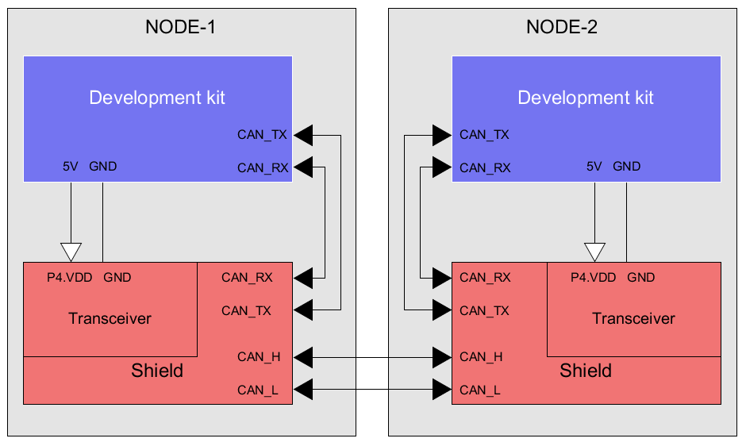
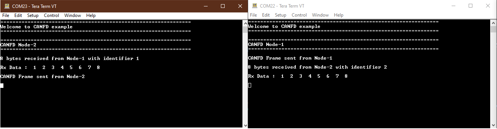

# CAN FD

Controller area network flexible data-rate (CAN FD) is a communication protocol typically used for broadcasting sensor data and control information on 2-wire interconnections between nodes. This example demonstrates how to use CAN FD in Infineon's PSoC&trade; 6 MCU, CYW20829 and CYW89829 device.

In this example, the CAN FD Node-1 sends a CAN FD frame to CAN FD-Node-2 on pressing the user button and vice versa. Both the CAN FD nodes log the received data over the UART terminal. Each time a CAN FD frame is received, the user LED toggles.

[View this README on GitHub.](https://github.com/Infineon/mtb-example-cat1-canfd)

[Provide feedback on this code example.](https://cypress.co1.qualtrics.com/jfe/form/SV_1NTns53sK2yiljn?Q_EED=eyJVbmlxdWUgRG9jIElkIjoiQ0UyMzcxNTciLCJTcGVjIE51bWJlciI6IjAwMi0zNzE1NyIsIkRvYyBUaXRsZSI6IkNBTiBGRCIsInJpZCI6ImtoYXRyaW5hdmluayIsIkRvYyB2ZXJzaW9uIjoiMS4xLjAiLCJEb2MgTGFuZ3VhZ2UiOiJFbmdsaXNoIiwiRG9jIERpdmlzaW9uIjoiTUNEIiwiRG9jIEJVIjoiSUNXIiwiRG9jIEZhbWlseSI6IlBTT0MifQ==)

## Requirements


- [ModusToolbox&trade;](https://www.infineon.com/modustoolbox) v3.0 or later (tested with v3.0)
- Board support package (BSP) minimum required version for:
   - PSoC&trade; 6 MCU: 4.0.0
   - CYW920829M2EVK-02: v1.0.1
   - CYW989829M2EVB-01: v1.0.1
- Programming language: C
- Associated parts: [PSoC&trade; 62](https://www.infineon.com/cms/en/product/microcontroller/32-bit-psoc-arm-cortex-microcontroller/psoc-6-32-bit-arm-cortex-m4-mcu/psoc-62), [AIROC&trade; CYW20829 Bluetooth&reg; LE SoC](https://www.infineon.com/cms/en/product/promopages/airoc20829) and [AIROC&trade; CYW89829 Bluetooth&reg; LE SoC]() MCU parts with CAN FD feature.

## Supported toolchains (make variable 'TOOLCHAIN')

- GNU Arm&reg; Embedded Compiler v10.3.1 (`GCC_ARM`) - Default value of `TOOLCHAIN`
- Arm&reg; Compiler v6.16 (`ARM`)
- IAR C/C++ Compiler v9.30.1 (`IAR`)

## Supported kits (make variable 'TARGET')

- [PSoC&trade; 62S3 Wi-Fi Bluetooth&reg; prototyping kit](https://www.infineon.com/CY8CPROTO-062S3-4343W) (`CY8CPROTO-062S3-4343W`) – Default value of `TARGET`
- [AIROC&trade; CYW20829 Bluetooth&reg; LE evaluation Kit](https://www.infineon.com/CYW920829M2EVK-02) (`CYW920829M2EVK-02`)
- [AIROC&trade; CYW89829 Bluetooth&reg; LE evaluation kit]() (`CYW989829M2EVB-01`)
- [PSoC&trade; 62S4 pioneer kit](https://www.infineon.com/CY8CKIT-062S4) (`CY8CKIT-062S4`)


## Hardware setup

This example uses the board's default configuration for CY8CPROTO-062S3-4343W. See the kit user guide and schematic to ensure that the board is configured correctly.

**Note:** The AIROC&trade; CYW89829 Bluetooth&reg; kit (CYW989829M2EVB-01) requires rework on the board to work with CAN. CAN RX/TX use P3.2 and P3.3 which was used for UART and connecting to J12 in default. To use UART, UART can map to P1.2(ARD_D5_SWDIO) and P1.3(ARD_D4_SWDCLK), Need remove jump on J12 5&6 and J12 7&8, connect J6.4(ARD_D5_SWDIO) to J12.5 and J6.3(ARD_D4_SWDCLK) to J12.7. Since P1.2 and P1.3 worked for UART, SWD for debug is not possible.

**Note:** The AIROC&trade; CYW20829 Bluetooth&reg; kit (CYW920829M2EVK-02) ships with KitProg3 version 2.21 installed. The ModusToolbox&trade; software requires KitProg3 with latest version 2.40. Before using this code example, make sure that the board is upgraded to KitProg3. The tool and instructions are available in the [Firmware Loader](https://github.com/Infineon/Firmware-loader) GitHub repository. If you do not upgrade, you will see an error such as "unable to find CMSIS-DAP device" or "KitProg firmware is out of date".

**Note:** CY8CKIT-062S4 requires rework on the board to work with CAN. Replace **R124** with **R125** to connect P5[1] of the MCU to J4[4]. See [PSoC&trade; 62S4 Pioneer Kit schematic](https://www.infineon.com/cms/en/product/evaluation-boards/cy8ckit-062s4/#!?fileId=8ac78c8c7d710014017d7153484d2081) for details.

This code example requires minimum two kits listed in the
[Supported kits](#supported-kits-make-variable-target) section. The first kit runs this example as is; the second kit should be programmed with the `USE_CANFD_NODE` macro as "CANFD_NODE_2" in the *main.c* file.

In addition, each kit from [Supported kits](#supported-kits-make-variable-target) requires a CY8CKIT-026 (CAN and LIN Shield) kit, which acts as the physical layer for each node.

**Note**: Here, pins 1 and 2 of J20 of CY8CKIT-026 are shorted using a jumper. See Section 3.6.4, **Power Selection Jumper (J20)** of the [CY8CKIT-026 CAN and LIN Shield kit guide](https://www.infineon.com/cms/en/product/evaluation-boards/cy8ckit-026/#!?fileId=8ac78c8c7d0d8da4017d0efb313a110d) for more details.

**Figure 1. CAN FD connections**



Use jumper wires to establish a connection between CAN FD-NODE-1 and CAN FD-NODE-2. See Figure 1.


1. Connect CAN_RX and CAN_TX pins of the development kits to the respective CY8CKIT-026 kit's CAN_RX and CAN_TX pins.

2. Connect the CAN2_L (J23[1]) pin of NODE-1 and NODE-2 using jumper wires on CY8CKIT-026.

3. Connect the CAN2_H (J23[2]) pin of NODE-1 and NODE-2 using jumper wires on CY8CKIT-026.

4. In both CY8CKIT-026 kits, connect J1[7] to 5 V to power the CAN2 transceiver.

See Table 1 for pin assignments for NODE-1 and NODE-2 for supported kits.

**Table 1. Pin connections between the supported development kit and CY8CKIT-026 kit for each node**

Kit | CAN_RX | CAN_TX | Ground | Power to CAN2 transceiver
---|---|---|--|----
CYW989829M2EVB-01 | 3[2]/J12[6] | 3[3]/J12[8] | GND | J117[1] (VCC.3.3V)
CYW920829M2EVK-02 | 5[0] | 5[1] | GND | J1[4] (VCC.5V)
CY8CPROTO-062S3-4343W | 5[0] | 5[1] | GND | J9[1] (VCC.5V)
CY8CKIT-062S4 | 5[0] | 5[1] | GND | J1[4] (V5.0)
CY8CKIT-026 | J9[3] | J9[2] | GND | J1[7] (P4.VDD)
<br>


## Software setup

See the [ModusToolbox&trade; tools package installation guide](https://www.infineon.com/ModusToolboxInstallguide) for information about installing and configuring the tools package.
Install a terminal emulator if you don't have one. Instructions in this document use [Tera Term](https://ttssh2.osdn.jp/index.html.en).


## Using the code example

Create the project and open it using one of the following:

<details><summary><b>In Eclipse IDE for ModusToolbox&trade; software</b></summary>

1. Click the **New Application** link in the **Quick Panel** (or, use **File** > **New** > **ModusToolbox&trade; Application**). This launches the [Project Creator](https://www.infineon.com/ModusToolboxProjectCreator) tool.

2. Pick a kit supported by the code example from the list shown in the **Project Creator - Choose Board Support Package (BSP)** dialog.

   When you select a supported kit, the example is reconfigured automatically to work with the kit. To work with a different supported kit later, use the [Library Manager](https://www.infineon.com/ModusToolboxLibraryManager) to choose the BSP for the supported kit. You can use the Library Manager to select or update the BSP and firmware libraries used in this application. To access the Library Manager, click the link from the **Quick Panel**.

   You can also just start the application creation process again and select a different kit.

   If you want to use the application for a kit not listed here, you may need to update the source files. If the kit does not have the required resources, the application may not work.

3. In the **Project Creator - Select Application** dialog, choose the example by enabling the checkbox.

4. (Optional) Change the suggested **New Application Name**.

5. The **Application(s) Root Path** defaults to the Eclipse workspace which is usually the desired location for the application. If you want to store the application in a different location, you can change the *Application(s) Root Path* value. Applications that share libraries should be in the same root path.

6. Click **Create** to complete the application creation process.

For more details, see the [Eclipse IDE for ModusToolbox&trade; software user guide](https://www.infineon.com/MTBEclipseIDEUserGuide) (locally available at *{ModusToolbox&trade; software install directory}/docs_{version}/mt_ide_user_guide.pdf*).

</details>

<details><summary><b>In command-line interface (CLI)</b></summary>

ModusToolbox&trade; software provides the Project Creator as both a GUI tool and the command line tool, "project-creator-cli". The CLI tool can be used to create applications from a CLI terminal or from within batch files or shell scripts. This tool is available in the *{ModusToolbox&trade; software install directory}/tools_{version}/project-creator/* directory.

Use a CLI terminal to invoke the "project-creator-cli" tool. On Windows, use the command line "modus-shell" program provided in the ModusToolbox&trade; software installation instead of a standard Windows command-line application. This shell provides access to all ModusToolbox&trade; software tools. You can access it by typing `modus-shell` in the search box in the Windows menu. In Linux and macOS, you can use any terminal application.

The "project-creator-cli" tool has the following arguments:

Argument | Description | Required/optional
---------|-------------|-----------
`--board-id` | Defined in the `<id>` field of the [BSP](https://github.com/Infineon?q=bsp-manifest&type=&language=&sort=) manifest | Required
`--app-id`   | Defined in the `<id>` field of the [CE](https://github.com/Infineon?q=ce-manifest&type=&language=&sort=) manifest | Required
`--target-dir`| Specify the directory in which the application is to be created if you prefer not to use the default current working directory | Optional
`--user-app-name`| Specify the name of the application if you prefer to have a name other than the example's default name | Optional

<br>

The following example clones the "[mtb-example-cat1-canfd](https://github.com/Infineon/mtb-example-cat1-canfd)" application with the desired name "MyCANFD" configured for the *CY8CPROTO*-*062S3*-*4343W* BSP into the specified working directory, *C:/mtb_projects*:

   ```
   project-creator-cli --board-id CY8CPROTO-062S3-4343W --app-id mtb-example-cat1-canfd --user-app-name MyCANFD --target-dir "C:/mtb_projects"
   ```

**Note:** The project-creator-cli tool uses the `git clone` and `make getlibs` commands to fetch the repository and import the required libraries. For details, see the "Project creator tools" section of the [ModusToolbox&trade; software user guide](https://www.infineon.com/ModusToolboxUserGuide) (locally available at *{ModusToolbox&trade; software install directory}/docs_{version}/mtb_user_guide.pdf*).

To work with a different supported kit later, use the [Library Manager](https://www.infineon.com/ModusToolboxLibraryManager) to choose the BSP for the supported kit. You can invoke the Library Manager GUI tool from the terminal using `make library-manager` command or use the Library Manager CLI tool "library-manager-cli" to change the BSP.

The "library-manager-cli" tool has the following arguments:

Argument | Description | Required/optional
---------|-------------|-----------
`--add-bsp-name` | Name of the BSP that should be added to the application | Required
`--set-active-bsp` | Name of the BSP that should be as active BSP for the application | Required
`--add-bsp-version`| Specify the version of the BSP that should be added to the application if you do not wish to use the latest from manifest | Optional
`--add-bsp-location`| Specify the location of the BSP (local/shared) if you prefer to add the BSP in a shared path | Optional

<br>

The following example adds the CY8CKIT-062S4 BSP to the already created application and makes it the active BSP for the app:

   ```
   library-manager-cli --project "C:/mtb_projects/MyCANFD" --add-bsp-name CY8CKIT-062S4 --add-bsp-version "latest-v4.X" --add-bsp-location "local"

   library-manager-cli --project "C:/mtb_projects/MyCANFD" --set-active-bsp APP_CY8CKIT-062S4
   ```

</details>

<details><summary><b>In third-party IDEs</b></summary>

Use one of the following options:

- **Use the standalone [Project Creator](https://www.infineon.com/ModusToolboxProjectCreator) tool:**

   1. Launch Project Creator from the Windows Start menu or from *{ModusToolbox&trade; software install directory}/tools_{version}/project-creator/project-creator.exe*.

   2. In the initial **Choose Board Support Package** screen, select the BSP, and click **Next**.

   3. In the **Select Application** screen, select the appropriate IDE from the **Target IDE** drop-down menu.

   4. Click **Create** and follow the instructions printed in the bottom pane to import or open the exported project in the respective IDE.

<br>

- **Use command-line interface (CLI):**

   1. Follow the instructions from the **In command-line interface (CLI)** section to create the application.

   2. Export the application to a supported IDE using the `make <ide>` command.

   3. Follow the instructions displayed in the terminal to create or import the application as an IDE project.

For a list of supported IDEs and more details, see the "Exporting to IDEs" section of the [ModusToolbox&trade; software user guide](https://www.infineon.com/ModusToolboxUserGuide) (locally available at *{ModusToolbox&trade; software install directory}/docs_{version}/mtb_user_guide.pdf*).

</details>


## Operation

1. Connect the CAN and ground pins of the development kit using the instructions in the [Hardware setup](#hardware-setup) section.

2. Connect the CANFD-NODE-1 development kit to your PC using the provided USB cable through the KitProg3 USB connector to program the device.

3. Program the board using one of the following:

   <details><summary><b>Using Eclipse IDE for ModusToolbox&trade; software</b></summary>

      1. Select the application project in the Project Explorer.

      2. In the **Quick Panel**, scroll down, and click **\<Application Name> Program (KitProg3_MiniProg4)**.
   </details>

   <details><summary><b>Using CLI</b></summary>

     From the terminal, execute the `make program` command to build and program the application using the default toolchain to the default target. The default toolchain is specified in the application's Makefile but you can override this value manually:
      ```
      make program TOOLCHAIN=<toolchain>
      ```

      Example:
      ```
      make program TOOLCHAIN=GCC_ARM
      ```
   </details>

4. Connect the CAN FD-NODE-2 kit to your PC using the provided USB cable through the KitProg3 USB connector. Open the *main.c* file and set the `USE_CANFD_NODE` macro to `CANFD_NODE_2`, and follow **Step 3**.

5. Open a terminal program and select the KitProg3 COM port. Set the serial port parameters to 8N1 and 115200 baud.

6. Press **SW2** from NODE-1, for transmission of frame from NODE-1 to NODE-2 and vice-versa.

7. Observe the results in the terminal window. You can see the print-logs from both nodes by opening another instance of the terminal. Figure 2 shows the print logs from both nodes.

    **Figure 2. Sample output with CAN FD data transmission and reception**

    

## Debugging

You can debug the example to step through the code. In the IDE, use the **\<Application Name> Debug (KitProg3_MiniProg4)** configuration in the **Quick Panel**. For details, see the "Program and debug" section in the [Eclipse IDE for ModusToolbox&trade; software user guide](https://www.infineon.com/MTBEclipseIDEUserGuide).

**Note:** **(Only for CYW989829M2EVB-01)** SWD debug is not possible if enable UART with P1.2/P1.3 since they overlap with SWD pins.

**Note:** **(Only while debugging)** (applicable here only for PSoC6) On the CM4 CPU, some code in `main()` may execute before the debugger halts at the beginning of `main()`. This means that some code executes twice – once before the debugger stops execution, and again after the debugger resets the program counter to the beginning of `main()`. See [KBA231071](https://community.infineon.com/docs/DOC-21143) to learn about this and for the workaround.


## Design and implementation

Controller Area Network Flexible Data Rate (CAN FD) is a data communication protocol used for broadcasting sensor data and control information on 2-wire interconnections between different parts of the electronic instrumentation and control system. Using CAN FD, Electronic Control Units (ECUs) can dynamically switch between different data rates and longer or shorter messages.

In this code example, the CAN FD block is configured with custom configurations because it is not configured to work with default BSP configurations.

This design consists of a CAN FD configuration as nodes and a user button. On a button press from one node, nodes send the CAN frame to the other and vice versa; both the CAN FD nodes log the received data over the UART serial terminal. The user LED toggles each time a CAN FD frame is received.


### CAN FD frame format

ID   - CAN FD identifier
DLC  - Data length code
Data - Actual data bytes

ID  | DLC | Data
------|------------|------
0x22 | 0x08 | 0x01 0x02 0x03 0x04 0x05 0x06 0x07 0x08


### Resources and settings

Figure 3 highlights the CAN FD configuration and parameter settings.


**Figure 3. CAN FD configuration**


**Table 2. Application resources**

Resource  |  Alias/object     |    Purpose
:------- | :------------    | :------------
CANFD (PDL) |canfd_0_chan_0_HW  | To generate CAN FD frames

<br>

## Related resources


Resources  | Links
-----------|----------------------------------
Application notes  | [AN228571](https://www.infineon.com/AN228571) – Getting started with PSoC&trade; 6 MCU on ModusToolbox&trade; software <br>  [AN215656](https://www.infineon.com/AN215656) – PSoC&trade; 6 MCU: Dual-CPU system design
Code examples  | [Using ModusToolbox&trade;](https://github.com/Infineon/Code-Examples-for-ModusToolbox-Software) on GitHub
Device documentation | [PSoC&trade; 6 MCU datasheets](https://documentation.infineon.com/html/psoc6/bnm1651211483724.html) <br> [PSoC&trade; 6 technical reference manuals](https://documentation.infineon.com/html/psoc6/zrs1651212645947.html)<br> <br> [AIROC&trade; CYW20829 Bluetooth&reg; LE SoC](https://www.infineon.com/cms/en/product/promopages/airoc20829)<br> [AIROC&trade; CYW89829 Bluetooth&reg; LE SoC]()
Development kits | Select your kits from the [Evaluation board finder](https://www.infineon.com/cms/en/design-support/finder-selection-tools/product-finder/evaluation-board).
Libraries on GitHub  | [mtb-pdl-cat1](https://github.com/Infineon/mtb-pdl-cat1) – PSoC&trade; 6 Peripheral Driver Library (PDL)  <br> [mtb-hal-cat1](https://github.com/Infineon/mtb-hal-cat1) – Hardware Abstraction Layer (HAL) library <br> [retarget-io](https://github.com/Infineon/retarget-io) – Utility library to retarget STDIO messages to a UART port
Middleware on GitHub  | [capsense](https://github.com/Infineon/capsense) – CAPSENSE&trade; library and documents <br> [psoc6-middleware](https://github.com/Infineon/modustoolbox-software#psoc-6-middleware-libraries) – Links to all PSoC&trade; 6 MCU middleware
Tools  | [ModusToolbox&trade;](https://www.infineon.com/modustoolbox) – ModusToolbox&trade; software is a collection of easy-to-use libraries and tools enabling rapid development with Infineon MCUs for applications ranging from wireless and cloud-connected systems, edge AI/ML, embedded sense and control, to wired USB connectivity using PSoC&trade; Industrial/IoT MCUs, AIROC&trade; Wi-Fi and Bluetooth&reg; connectivity devices, XMC&trade; Industrial MCUs, and EZ-USB&trade;/EZ-PD&trade; wired connectivity controllers. ModusToolbox&trade; incorporates a comprehensive set of BSPs, HAL, libraries, configuration tools, and provides support for industry-standard IDEs to fast-track your embedded application development.

<br>

## Other resources

Infineon provides a wealth of data at www.infineon.com to help you select the right device, and quickly and effectively integrate it into your design.

For PSoC&trade; 6 MCU devices, see [How to design with PSoC&trade; 6 MCU - KBA223067](https://community.infineon.com/docs/DOC-14644) in the Infineon Developer community.


## Document history

Document title: *CE237157* - *CAN FD*

 Version | Description of change
 ------- | ---------------------
 1.0.0   | New code example
 1.1.0   | Added support for CYW920829M2EVK-02 and CYW989829M2EVB-01
<br>

All referenced product or service names and trademarks are the property of their respective owners.

The Bluetooth&reg; word mark and logos are registered trademarks owned by Bluetooth SIG, Inc., and any use of such marks by Infineon is under license.


---------------------------------------------------------

© Cypress Semiconductor Corporation, 2020-2023. This document is the property of Cypress Semiconductor Corporation, an Infineon Technologies company, and its affiliates ("Cypress").  This document, including any software or firmware included or referenced in this document ("Software"), is owned by Cypress under the intellectual property laws and treaties of the United States and other countries worldwide.  Cypress reserves all rights under such laws and treaties and does not, except as specifically stated in this paragraph, grant any license under its patents, copyrights, trademarks, or other intellectual property rights.  If the Software is not accompanied by a license agreement and you do not otherwise have a written agreement with Cypress governing the use of the Software, then Cypress hereby grants you a personal, non-exclusive, nontransferable license (without the right to sublicense) (1) under its copyright rights in the Software (a) for Software provided in source code form, to modify and reproduce the Software solely for use with Cypress hardware products, only internally within your organization, and (b) to distribute the Software in binary code form externally to end users (either directly or indirectly through resellers and distributors), solely for use on Cypress hardware product units, and (2) under those claims of Cypress's patents that are infringed by the Software (as provided by Cypress, unmodified) to make, use, distribute, and import the Software solely for use with Cypress hardware products.  Any other use, reproduction, modification, translation, or compilation of the Software is prohibited.
<br>
TO THE EXTENT PERMITTED BY APPLICABLE LAW, CYPRESS MAKES NO WARRANTY OF ANY KIND, EXPRESS OR IMPLIED, WITH REGARD TO THIS DOCUMENT OR ANY SOFTWARE OR ACCOMPANYING HARDWARE, INCLUDING, BUT NOT LIMITED TO, THE IMPLIED WARRANTIES OF MERCHANTABILITY AND FITNESS FOR A PARTICULAR PURPOSE.  No computing device can be absolutely secure.  Therefore, despite security measures implemented in Cypress hardware or software products, Cypress shall have no liability arising out of any security breach, such as unauthorized access to or use of a Cypress product. CYPRESS DOES NOT REPRESENT, WARRANT, OR GUARANTEE THAT CYPRESS PRODUCTS, OR SYSTEMS CREATED USING CYPRESS PRODUCTS, WILL BE FREE FROM CORRUPTION, ATTACK, VIRUSES, INTERFERENCE, HACKING, DATA LOSS OR THEFT, OR OTHER SECURITY INTRUSION (collectively, "Security Breach").  Cypress disclaims any liability relating to any Security Breach, and you shall and hereby do release Cypress from any claim, damage, or other liability arising from any Security Breach.  In addition, the products described in these materials may contain design defects or errors known as errata which may cause the product to deviate from published specifications. To the extent permitted by applicable law, Cypress reserves the right to make changes to this document without further notice. Cypress does not assume any liability arising out of the application or use of any product or circuit described in this document. Any information provided in this document, including any sample design information or programming code, is provided only for reference purposes.  It is the responsibility of the user of this document to properly design, program, and test the functionality and safety of any application made of this information and any resulting product.  "High-Risk Device" means any device or system whose failure could cause personal injury, death, or property damage.  Examples of High-Risk Devices are weapons, nuclear installations, surgical implants, and other medical devices.  "Critical Component" means any component of a High-Risk Device whose failure to perform can be reasonably expected to cause, directly or indirectly, the failure of the High-Risk Device, or to affect its safety or effectiveness.  Cypress is not liable, in whole or in part, and you shall and hereby do release Cypress from any claim, damage, or other liability arising from any use of a Cypress product as a Critical Component in a High-Risk Device. You shall indemnify and hold Cypress, including its affiliates, and its directors, officers, employees, agents, distributors, and assigns harmless from and against all claims, costs, damages, and expenses, arising out of any claim, including claims for product liability, personal injury or death, or property damage arising from any use of a Cypress product as a Critical Component in a High-Risk Device. Cypress products are not intended or authorized for use as a Critical Component in any High-Risk Device except to the limited extent that (i) Cypress's published data sheet for the product explicitly states Cypress has qualified the product for use in a specific High-Risk Device, or (ii) Cypress has given you advance written authorization to use the product as a Critical Component in the specific High-Risk Device and you have signed a separate indemnification agreement.
<br>
Cypress, the Cypress logo, and combinations thereof, ModusToolbox, PSoC, CAPSENSE, EZ-USB, F-RAM, and TRAVEO are trademarks or registered trademarks of Cypress or a subsidiary of Cypress in the United States or in other countries. For a more complete list of Cypress trademarks, visit www.infineon.com. Other names and brands may be claimed as property of their respective owners.
